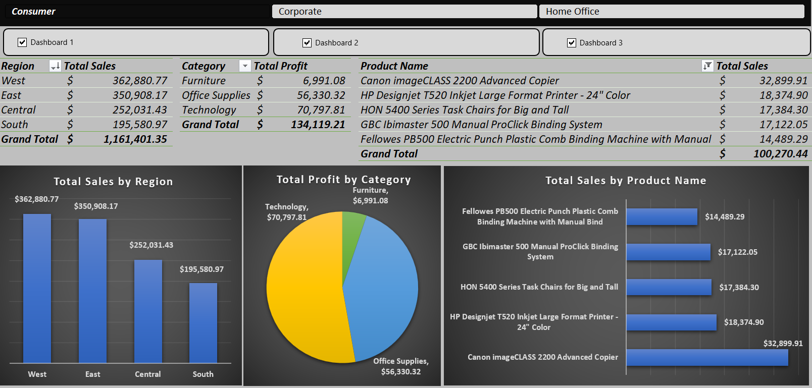
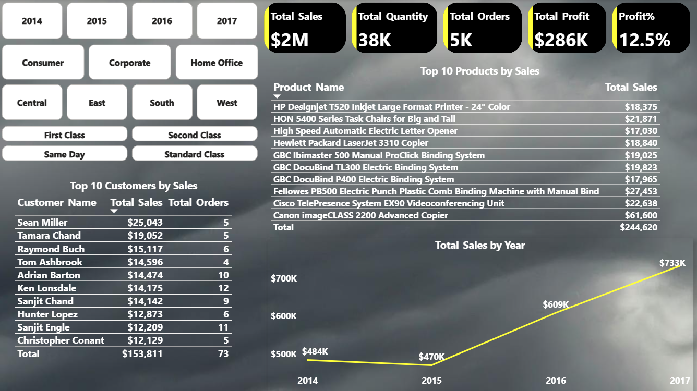
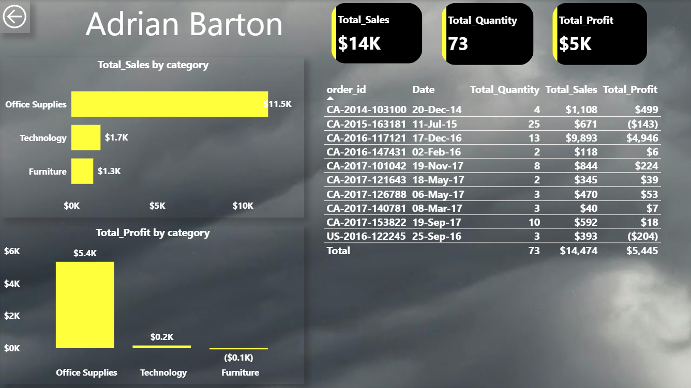
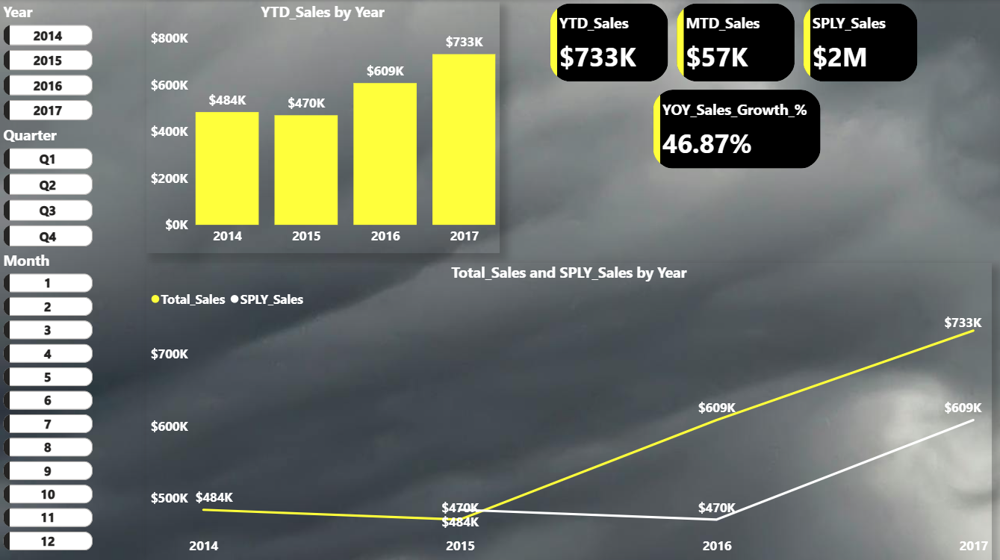

# 📊 Retail Sales Analysis – Excel + SQL + Power BI Project
**Tools Used:** Excel, PostgreSQL, Power BI
**Dataset:** Superstore Dataset (Kaggle)
**Files:** Excel .xlsm, SQL scripts, .pbix file, cleaned CSVs

---

## 🔍 Project Overview
This is a full-stack data analysis project that covers the complete lifecycle of analytics — from raw data cleaning and modeling to advanced SQL querying and dashboard building. It demonstrates proficiency in Excel, SQL (PostgreSQL) and Power BI.

The dataset was normalized into relational tables, queried for business insights using SQL and visualized through interactive dashboards in both Excel and Power BI.

## 🧠 Key Features
**🔹 Excel Dashboard**

Created a macro-enabled dashboard with PivotTables, slicers, formulas and charts across 5 sheets

Used Power Query for cleaning and transformation

Included KPI Cards, Top Products, Sales by Region and Monthly Trends

**🔹 SQL Analysis**

Normalized the flat dataset into 4 tables: customers, orders, products, order_details

Wrote SQL queries using JOINs, CTEs, subqueries and window functions

Analyzed trends like YoY sales, negative profit products, and monthly performance

**🔹 Power BI Dashboard**

Built a multi-page interactive dashboard:

Main KPI dashboard (Sales, Profit, Profit %, Quantity, Orders)

Customer drillthrough page with order history

Time Intelligence page: YTD, MTD, SPLY, YoY Growth

Used DAX measures and created a separate Date table for time-based analysis

📁 Files Included
📂 Excel
- `Superstore_Excel_Dashboard.xlsm` – Macro-enabled workbook

📂 SQL
- `superstore_flat_analysis.sql` – SQL queries on flat CSV

- `superstore_relational_analysis.sql` – SQL queries on relational tables

- `superstore.csv` – Original dataset

- `customers.csv, products.csv, orders.csv, order_details.csv` – Normalized tables

📂 PowerBI
- `superstore_dashboard.pbix` – Power BI report

Main Dashboard

Customer Drillthrough

Time Intelligence Overview

✅ Concepts Covered
Data Cleaning & Normalization (Power Query, Excel, SQL)

Relational Database Design & SQL Joins

Aggregations, Subqueries, CTEs and Window Functions

Excel Dashboarding with Slicers, Charts and KPIs

Power BI Data Modeling, DAX Measures and Time Intelligence
